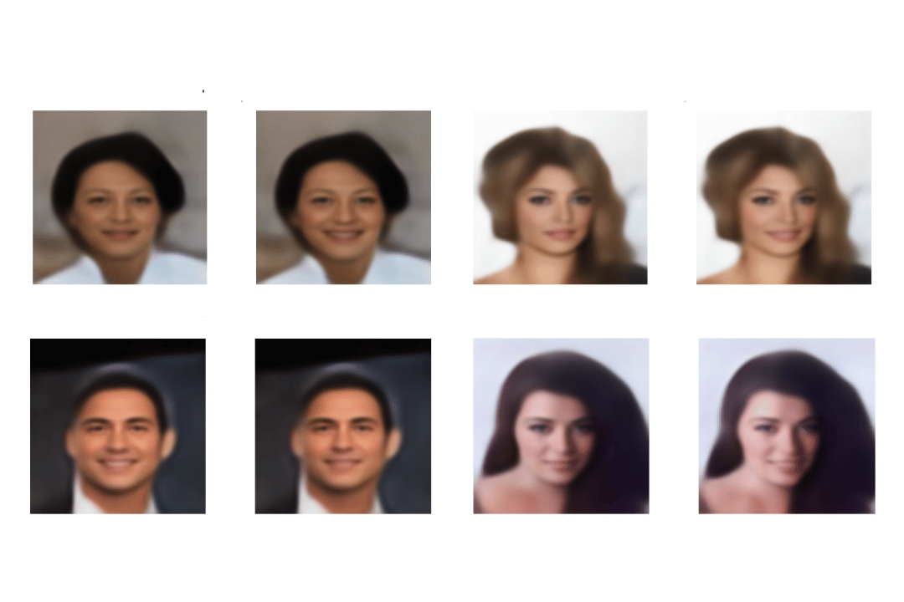

# VAE CelebA: Attribute Manipulation

This project focuses on utilizing a Variational Autoencoder (VAE) on the CelebA dataset to manipulate facial attributes, with a primary emphasis on attributes like smiling. By training a VAE on facial images, the model learns a latent space representation that allows for controlling specific attributes of the faces.

## Purpose

The main purpose of this project is to explore the capabilities of VAEs in manipulating facial attributes in images. Specifically, the project aims to:

- Train a VAE model on the CelebA dataset to learn latent representations of facial images.
- Use the trained VAE to manipulate attributes like smiling in facial images.
- Provide a framework for users to experiment with different attributes and observe the effects on facial expressions.


## Architecture
The architecture of the VAE model used in this project is as follows:
```plain text
----------------------------------------------------------------
        Layer (type)               Output Shape         Param #
================================================================
            Conv2d-1           [-1, 64, 56, 56]           1,792
              ReLU-2           [-1, 64, 56, 56]               0
           Dropout-3           [-1, 64, 56, 56]               0
            Conv2d-4          [-1, 128, 28, 28]          73,856
              ReLU-5          [-1, 128, 28, 28]               0
           Dropout-6          [-1, 128, 28, 28]               0
            Conv2d-7          [-1, 256, 14, 14]         295,168
              ReLU-8          [-1, 256, 14, 14]               0
           Dropout-9          [-1, 256, 14, 14]               0
           Conv2d-10            [-1, 512, 7, 7]       1,180,160
             ReLU-11            [-1, 512, 7, 7]               0
          Dropout-12            [-1, 512, 7, 7]               0
           Conv2d-13            [-1, 256, 7, 7]       1,179,904
             ReLU-14            [-1, 256, 7, 7]               0
          Dropout-15            [-1, 256, 7, 7]               0
           Linear-16                  [-1, 200]       2,509,000
           Linear-17                  [-1, 200]       2,509,000
          Encoder-18  [[-1, 200], [-1, 200], [-1, 200]]               0
           Linear-19                 [-1, 6272]       1,260,672
           Conv2d-20            [-1, 256, 7, 7]         295,168
        LeakyReLU-21            [-1, 256, 7, 7]               0
         Upsample-22          [-1, 256, 14, 14]               0
           Conv2d-23          [-1, 512, 14, 14]       1,180,160
        LeakyReLU-24          [-1, 512, 14, 14]               0
         Upsample-25          [-1, 512, 28, 28]               0
           Conv2d-26          [-1, 256, 28, 28]       1,179,904
        LeakyReLU-27          [-1, 256, 28, 28]               0
         Upsample-28          [-1, 256, 56, 56]               0
           Conv2d-29          [-1, 128, 56, 56]         295,040
        LeakyReLU-30          [-1, 128, 56, 56]               0
         Upsample-31        [-1, 128, 112, 112]               0
           Conv2d-32          [-1, 3, 112, 112]           3,459
          Sigmoid-33          [-1, 3, 112, 112]               0
          Decoder-34          [-1, 3, 112, 112]               0
================================================================
```

## Usage
1. Download the weights from this [Drive link](https://drive.google.com/drive/folders/1_zPXlRn54xTevDO72hPSyEw8PTLZY0MY?usp=sharing) (recommend to choose the lastest one).
1. Load the weights of the trained VAE model by this script:
  ```python
vae.load_state_dict(torch.load(weight_path))
```
3. Proceed to the Smiling Vector section to calculate the smiling vector.

## Results

The repository includes visualization scripts to display the generated images with attribute manipulation. You can find the generated images in the specified output folder.


## Notes

- This model is trained on facial images predominantly featuring Western individuals. Its performance on manipulating attributes in images of individuals from other demographics, such as Asians, may vary.
- The loss function of this model has reached a local minimum during training. Continuing to train the model may not significantly improve its performance or generate better results.


